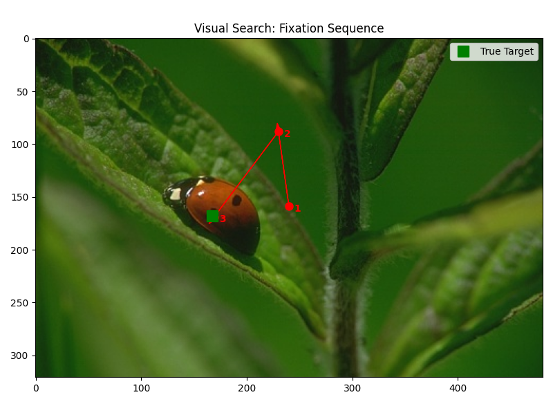
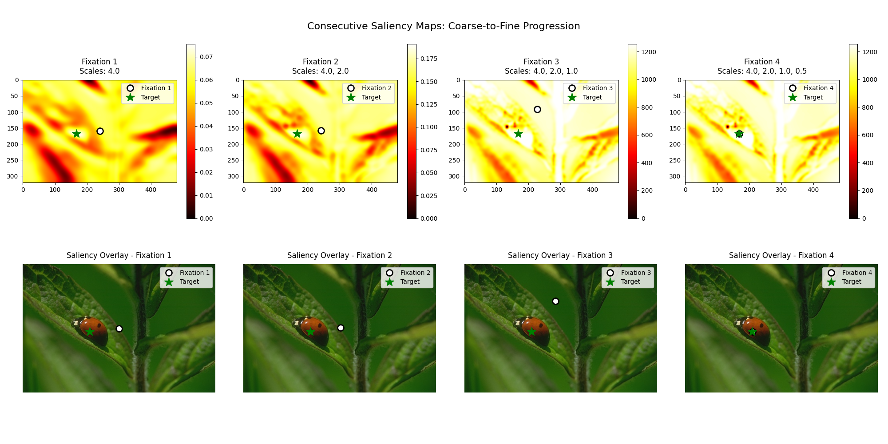

# Iconic Visual Search

Implementation of the iconic visual search model described in the paper by Rao et al. (2002), using steerable filters and coarse-to-fine strategy for target localization.

## Reference

This implementation is based on the following paper:

> Rao, Rajesh P.N., Gregory J. Zelinsky, Mary M. Hayhoe, and Dana H. Ballard. "Eye Movements in Iconic Visual Search." *Vision Research* 42, no. 11 (2002): 1447–63. https://doi.org/10.1016/S0042-6989(02)00040-8.

## Overview

The model implements a biologically-inspired visual search system that uses:
- **Steerable filters** based on Gaussian derivatives (up to 3rd order)
- **Multi-scale processing** with 3 spatial scales (2.0x, 1.0x, 0.5x)
- **Coarse-to-fine search strategy** with 3 fixations
- **Weighted population averaging** for attention guidance
- **Template matching** using iconic feature representations

## Installation

1. Clone the repository:
```bash
git clone https://github.com/julianZeitler/iconic-visual-search
cd iconic-visual-search
```

2. Install dependencies using uv (recommended):
```bash
uv sync
```

Or using pip:
```bash
pip install -e .
```

Or install manually:
```bash
pip install numpy opencv-python scipy matplotlib
```

### Using uv (Recommended)

This project uses [uv](https://docs.astral.sh/uv/) for fast dependency management. If you don't have uv installed:

```bash
# Install uv
curl -LsSf https://astral.sh/uv/install.sh | sh

# Or on Windows
powershell -ExecutionPolicy ByPass -c "irm https://astral.sh/uv/install.ps1 | iex"

# Then install project dependencies
uv sync
```

To run the project with uv:
```bash
uv run python main.py ladybug
uv run python main.py all
```

## Usage

### Process Single Image
```bash
python main.py ladybug                # Basic visualization
python main.py monkey --filters      # With detailed filter analysis
python main.py ladybug --saliency    # Show consecutive saliency maps
```

### Process All Images
```bash
python main.py all                    # Summary plots for all images
python main.py all --details         # Include individual detailed plots
```

### Other Commands
```bash
python main.py list                   # List available images
python main.py --help               # Show help
```

## Project Structure

```
iconic-visual-search/
├── main.py                          # Main script with CLI interface
├── visual_search.py                 # VisualSearchModel class
├── spatio_chromatic_filters.py      # SpatioChromaticFilters class
├── pyproject.toml                   # Project configuration
├── README.md                        # This file
├── results/                         # Some example results
└── images/
    ├── annotations.json             # Target annotations
    ├── astronauts.jpg               # Test images
    ├── bell_pepper.jpg
    ├── headdress.jpg
    ├── hut.jpg
    ├── ladybug.jpg
    ├── monkey.jpg
    └── workers.jpg
```

## Model Architecture

### 1. Spatio-Chromatic Filters (`SpatioChromaticFilters`)
- **Filter bank**: 10 steerable filters based on Gaussian derivatives
- **Multi-scale**: Applies filters at 3 different spatial scales
- **Feature extraction**: Creates iconic representation of image patches

### 2. Visual Search Model (`VisualSearchModel`)
- **Target memorization**: Stores template from target location
- **Saliency computation**: Computes similarity maps using filter responses
- **Coarse-to-fine search**: 3 fixations with decreasing temperature
- **Attention guidance**: Weighted population averaging for fixation selection

### 3. Search Process
2. **Fixation 1**: Coarse scale (2.0x), medium temperature (1) - regional focus
3. **Fixation 2**: Medium scale (1.0x), low temperature (0.1) - local search
4. **Fixation 3**: Fine scale (0.5x), very low temperature (0.01) - precise localization

## Visualizations

### Basic Mode
- Image with fixation sequence showing numbered points and arrows
- Green square marker indicating the true target location

### Filter Analysis Mode (--filters)
- **Filter response matrix**: Shows how different filters respond to target vs. image
- **Target template**: Visual representation of the memorized target template
- **Full image responses**: Complete filter responses across the entire image
- **Performance metrics**: Distance calculations and search accuracy

### Saliency Maps Mode (--saliency)
- **Consecutive saliency maps**: Shows saliency evolution across all 3 spatial scales
- **Scale progression**: Visualization of coarse-to-fine search strategy
- **Fixation overlay**: Original image with corresponding fixation points for each scale

## Example Results

When processing the test images, the model demonstrates:
- **Center-of-gravity effects** in early fixations
- **Progressive convergence** toward target locations
- **Scale-dependent processing** from global to local features

### Visual Search Results

**Basic Fixation Sequence:**



The model performs a coarse-to-fine visual search on the ladybug image, showing the progressive fixation sequence as numbered red circles with connecting arrows. The green square marks the true target location.

**Consecutive Saliency Maps:**



This visualization shows how the saliency maps evolve across different spatial scales (2.0x, 1.0x, 0.5x) during the coarse-to-fine search process. Bright areas indicate regions with high similarity to the target template. The bottom row shows the original image with the corresponding fixation point for each scale.

## Dependencies

- `numpy >= 1.20.0`: Numerical computations
- `opencv-python >= 4.5.0`: Image processing
- `scipy >= 1.7.0`: Signal processing (convolution)
- `matplotlib >= 3.3.0`: Visualization
- `typing-extensions >= 4.0.0`: Type hints (Python < 3.10)

## Citation

If you use this implementation in your research, please cite the original paper:

```bibtex
@article{rao2002eye,
  title={Eye movements in iconic visual search},
  author={Rao, Rajesh PN and Zelinsky, Gregory J and Hayhoe, Mary M and Ballard, Dana H},
  journal={Vision Research},
  volume={42},
  number={11},
  pages={1447--1463},
  year={2002},
  publisher={Elsevier},
  doi={10.1016/S0042-6989(02)00040-8}
}
```

## License

MIT License - see the LICENSE file for details.
